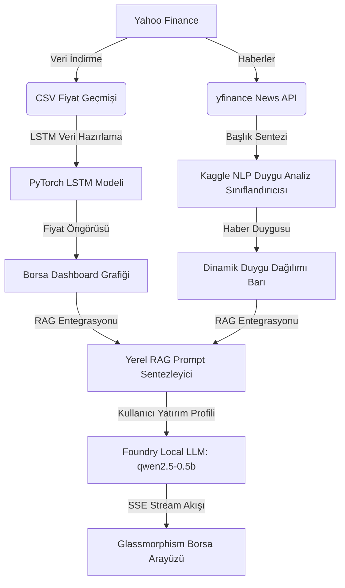

# 📈 FinAgent-LocalRAG: Yerel Yapay Zeka & Borsa Tahmin Terminali

<div align="center">


</div>

---

## 🌟 Proje Özeti
**FinAgent-LocalRAG**, borsa yatırımcıları için özel olarak tasarlanmış, **tamamen çevrimdışı (offline) çalışan** ve verilerinizin gizliliğini koruyan yapay zeka tabanlı bir finans analiz asistanıdır. 

Sistem; sayısal tahminler (LSTM), borsa duygu analizi (NLP) ve yerel dil modellerini (Qwen LLM) bir araya getirerek, kullanıcının belirlediği risk profiline ve yatırım vadesine göre kişiselleştirilmiş RAG raporları üretir.

---

## ⚙️ Sistem Mimarisi & Çalışma Akışı

Aşağıdaki diyagramda sistemin veriyi indirmesinden, yerel LLM üzerinden RAG analizi üretilmesine kadar olan tüm akış özetlenmektedir:



---

## 🚀 Öne Çıkan Gelişmiş Özellikler

*   **🤖 PyTorch LSTM Modeli:** Zaman serisi verilerini otomatik normalize eder, PyTorch üzerinde eğitilir ve bir sonraki günün yönünü (trend) ve tahmini kapanış fiyatını hesaplar.
*   **📊 Canlı Teknik Göstergeler:** Son borsa fiyatı, **RSI (14)**, **MA5 (5 Günlük Ortalama)**, **İşlem Hacmi** ve modelin hata payından (RMSE) türetilen **LSTM Güven Skoru** anlık olarak hesaplanır.
*   **📰 Haber NLP Duygu Dağılımı:** Makine öğrenmesi tabanlı duygu analizi sınıflandırıcısı, son haberleri analiz ederek "Olumlu-Nötr-Olumsuz" oranlarını görsel bir çubuk grafik halinde sunar.
*   **⚙️ Kişiselleştirilmiş Yatırım Stili:** Ayarlar panelindeki **Risk Toleransı** (Korumacı, Dengeli, Agresif) ve **Yatırım Vadesi** (Kısa, Orta, Uzun) tercihlerine göre yapay zeka yatırım önerilerini ve rapor dilini şekillendirir.
*   **🎨 Çoklu Neon Temalar (Visual Themes Selector):** Neon Mavi, Neon Mor, Zümrüt Yeşili ve Kızıl Şafak temaları arasında tek tıkla geçiş olanağı sağlar.
*   **💵 Çoklu Para Birimi (Currency Auto-Format):** Para birimi değişimlerinde grafiklerin, fiyatların ve tabloların otomatik olarak ($, ₺, €) biçimlendirilmesi sağlanmıştır.

---

## 📦 Kurulum ve Kullanım

### 1. Kütüphanelerin Yüklenmesi
Gerekli Python paketlerini yüklemek için terminalde çalıştırın:
```powershell
pip install -r requirements.txt
```

### 2. Uygulamayı Başlatma
Yerel Flask sunucusunu ve model motorunu ayağa kaldırmak için:
```powershell
python app.py
```
Sunucu başladığında tarayıcınızda **[http://127.0.0.1:5000](http://127.0.0.1:5000)** adresine giderek borsa terminalini kullanmaya başlayabilirsiniz.

---

## 👤 Geliştirici & Lisans
*   **İnan Demir** - [GitHub Profiliniz](https://github.com/inandemir)
